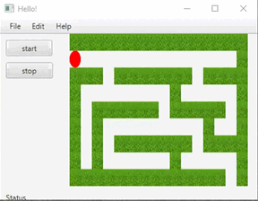

# javaFX-maze

A maze game, you have to take the red circle out of the maze

### For example:

## Features:
To start the game click "start" 

To move the player (red circle) we will use the keyboard keys -

    
